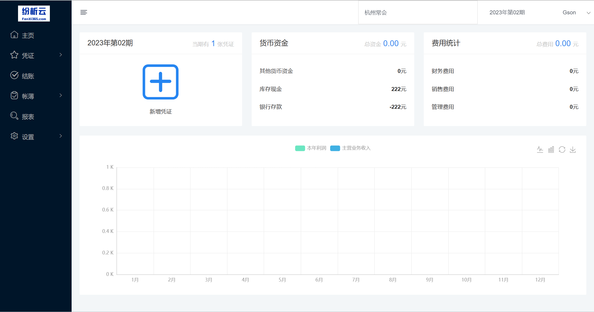
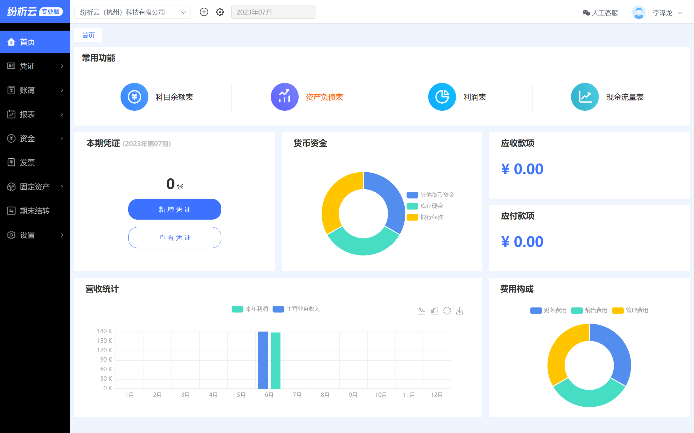

## 纷析云-财务软件源码[开源版]

### 项目介绍
**纷析云SAAS云财务软件开源版** 
包含账套、凭证字、科目、期初、币别、账簿、报表、凭证、结账
### 技术交流群
扫码添加客服进群 

### 商业版地址
纷析云商业版 
https://f3.fenxi365.com/  
正式环境，可注册账号直接使用或测试

### 功能对比
| 功能模块| 开源版| 商业版[技术重构]| 
|----|----|----|
| 凭证 | ✔ | ✔ | 
| 账簿 | ✔ | ✔ | 
| 报表 | ✔ | ✔ | 
| 结账 | ✔| ✔ | 
| 设置 | ✔ | ✔ | 
| 自定义报表| ✗ | ✔ |
| 资金 | ✗ | ✔ | 
| 固定资产 |✗  | ✔ | 
| 发票 |✗  | ✔| 
| 商户管理后台 | ✗ | ✔| 

### 数据结构[实体类]

    AccountingCategory          辅助核算项目类别
    AccountingCategoryDetails   辅助核算项目明细
    AccountSets                 账套
    Checkout                    结账
    Currency                    币别
    ReportTemplate              报表模板
    ReportTemplateItems         报表项目
    ReportTemplateItemsFormula  报表公式
    Subject                     科目
    User                        用户管理
    UserAccountSets             用户账套
    Voucher                     凭证
    VoucherDetails              凭证明细
    VoucherDetailsAuxiliary     凭证明细辅助项
    VoucherTemplate             凭证模板
    VoucherTemplateDetails      凭证模板明细
    VoucherWord                 凭证字
### 技术选型
||开源版|商业版|
|----|----|----|
|JDK版本|1.8|17+|
|核心框架|Spring Boot2.x|Spring Boot3.1.x|
|持久层框架|MyBatis|JPA + queryDSL + sqltoy|
|缓存框架|Redis|Redis|
|数据库|mysql 5.7+|mysql8.0+|
|短信接口|阿里云|阿里云|
|前端框架|Vue2,heyui|Vue3,heyui,layer,vxe-table|

### 项目截图
开源版截图 

商业版截图 

### 版权许可
    开源不代表免费，纷析云财务 遵循 GPL-3.0 开源协议发布，并提供技术交流学习，
    但绝不允许修改后和衍生的代码做为闭源的商业软件发布和销售！
    如果需要将本产品在本地进行任何附带商业化性质行为使用，
    请联系项目负责人进行商业授权，以遵守 GPL 协议保证您的正常使用。
### 公司介绍

官网：[fenxi365.com](纷析云)  
纷析云（杭州）科技有限公司
